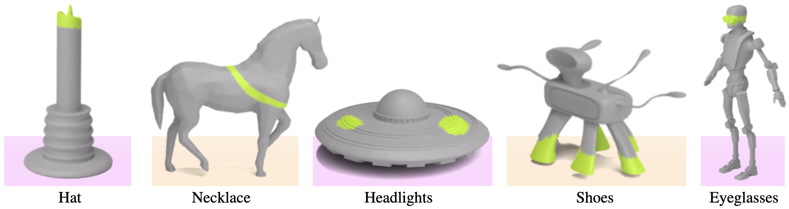

# 3D Highlighter

*[Dale Decatur](https://ddecatur.github.io/), [Itai Lang](https://scholar.google.com/citations?user=q0bBhtsAAAAJ&hl=en), [Rana Hanocka](https://people.cs.uchicago.edu/~ranahanocka/)*


<!-- [](https://arxiv.org/abs/2112.03221) -->
<!--  -->
<!--  -->



Public code release for "3D Highlighter: Localizing Regions on 3D Shapes via Text Descriptions".

### [[Project Page](https://threedle.github.io/3DHighlighter/)] [[ArXiv]()]

## Getting Started
### Installation

Note: The below installation will fail if run on something other than a CUDA GPU machine.
```
conda env create --file 3DHighlighter.yml
conda activate 3DHighlighter
```

### System Requirements
- Python 3.9
- CUDA 11
<!-- - 16 GB GPU -->

### Run Examples
Run the scripts below to get example localizations.
```
# hat on a dog
./demo/run_dog_hat.sh
# shoes on a horse
./demo/run_horse_shoes.sh
# hat on a candle
./demo/run_candle_hat.sh
```

### Note on Reproducibility
Due to the non-determinism of CLIP's backwards process, results can vary even when fully seeded.
If the result of the optimizaiton does not match the expected result, try re-running the optimization.

## Citation
```
@article{decatur2022highlighter,
         author = {Decatur, Dale and Lang, Itai and Hanocka, Rana},
         title  = {3D Highlighter: Localizing Regions on 3D Shapes via Text Descriptions},
         journal = {arXiv},
         year = {2022}
}
```
